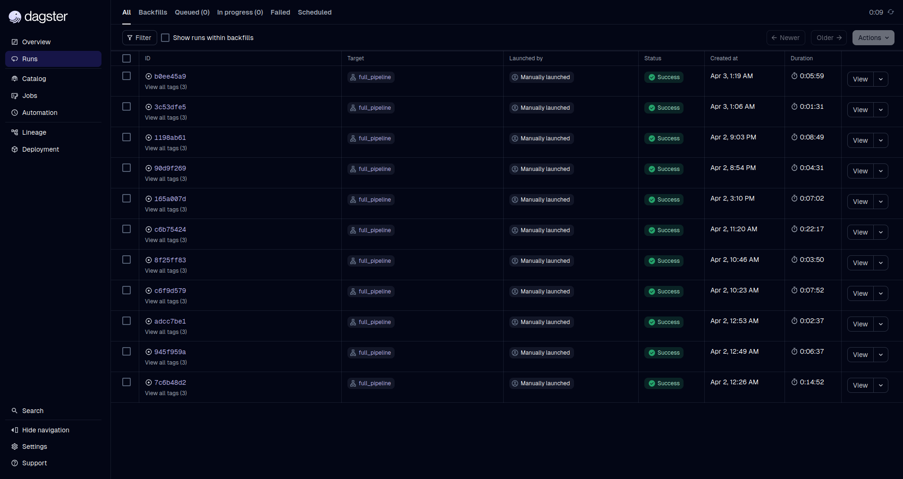

# Workplace Relations Scraping Pipeline

A production-grade pipeline to scrape Irish legal decisions, store them in MinIO, and transform HTML content.



## Dashboards & Monitoring

After starting the infrastructure with `docker compose up -d`, the following tools are available:

- **Dagster UI (Orchestration)**: [http://localhost:3000](http://localhost:3000)
- **MinIO Console (File Storage)**: [http://localhost:9001](http://localhost:9001)
    - Username: `minioadmin` | Password: `minioadmin` (see `.env`)
- **Mongo Express (Database Web UI)**: [http://localhost:8081](http://localhost:8081)
    - Username: `admin` | Password: `pass`

## Quick Start

1. Copy `.env.example` to `.env` and adjust as needed.
2. Run `docker compose up -d`
3. Access Dagster UI at http://localhost:3000
4. Launch the `full_pipeline` job via **Launchpad** with your desired date range.

## Features

- Scrapy with Playwright to bypass Cloudflare.
- Rotating user agents, retries, and rate limiting.
- Metadata stored in MongoDB.
- Files stored in MinIO object storage.
- Idempotent: uses file hashes to avoid duplicates.
- Orchestrated with Dagster.

## Database & Storage Architecture

The pipeline uses a decoupled storage architecture to maintain a robust data lake.

### MongoDB (`workplace_relations`)
Stores all metadata, tracking states, and parsed data.
- **`landing_documents`**: Stores the raw metadata from the Scrapy spiders (Total records as of last scan: **43,032**).
  - Core fields: `identifier`, `title`, `date` (stored as `YYYY-MM-DD` string), `body` (tribunal name).
  - Storage mapping: `file_path`, `file_hash`, `document_type`, `version`.
- **`transformed_documents`**: Stores final processed documents after `transform.py` unifies them.

### MinIO (`wrc-data`)
Object storage acts as our Data Lake for raw files. Documents are dynamically partitioned based on their historical decision dates.
- **Bucket**: `wrc-data`
- **Structure**: `{body_name}/{YYYY-MM}/{identifier}.{ext}` (e.g., `Workplace_Relations_Commission/2000-03/ADJ-0001.html`)

## Configuration

All settings via environment variables (`.env`) or `config.yaml`.

## Running Manually

```bash
docker compose up -d mongodb minio create-buckets
docker compose build dagster-webserver

# Run for a specific body + date range
docker compose run --rm dagster-webserver \
  scrapy crawl wr_spider \
  -a start_date=2025-01-01 \
  -a end_date=2025-02-01 \
  -a body_id=15376 \
  -a body_name="Workplace Relations Commission" \
  -a partition_date=2025-01

# Or run the full orchestrated scraper (all bodies, monthly partitions)
docker compose run --rm scraper \
python /opt/dagster/scripts/run_scraper.py --start-date 2025-10-01 --end-date 2025-11-01
```

## Testing & Coverage

The repository maintains strict test coverage ensuring orchestration mechanisms, HTML extraction, and scrapers work flawlessly.

To run the unified test suite and view your coverage breakdown, run the following from within your local virtual environment:

```bash
# Ensure your virtual environment is active or use the binary directly:
PYTHONPATH=. ./venv/bin/pytest tests/ --cov=. --cov-report=term-missing
```